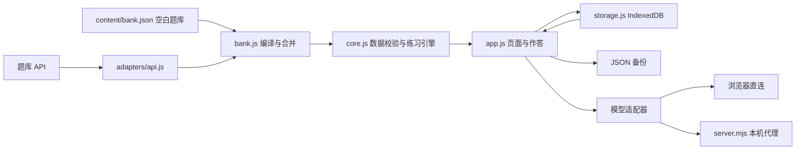

# 结构与扩展点

`core.js` 不依赖 DOM、存储或网络。判分、题目校验、错题集合及练习快照可以单独测试，也可以复用到桌面或服务端。`bank.js` 将作者格式补齐成存储格式；UI 保存和导入都经过同一套校验。

题目内容由使用者提供。初始化从仓库题库建立本机数据；已有进度时优先载入本机数据，更新仓库题库由显式同步按钮触发。练习使用题目快照，后续修改或删除原题不会改变历史参考答案。

`adapters/api.js` 是外部服务边界。题库适配器输出标准题库对象，大模型适配器输出纯文本。不同服务需要分页、签名、其他请求或响应结构时，改适配器；不要把厂商逻辑写入判分核心。

本机代理从 `.env.local` 读取配置，拒绝任意 URL 转发。浏览器直连与离线 HTML 共享同一套适配器，但要求远端 CORS。默认页面不开启任何后台同步或定时 API 调用。

可以继续扩展图片与附件、Markdown / 公式、更多题型和跨设备同步。当前题干与解析都是纯文本；新增富文本时需要单独设计渲染与内容清洗，不能直接把题库字符串插入 HTML。
