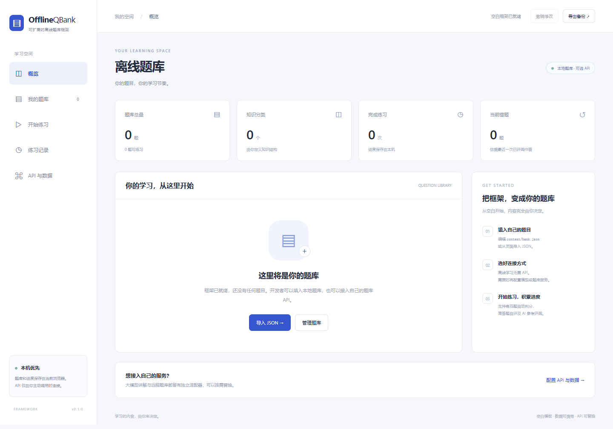

# OfflineQBank · 离线题库框架

A clone-and-customize, local-first question bank framework. Bring your own questions and optional API providers. **No questions are included.**

这是给开发者 clone 后自行填题、改界面、接服务的空白框架。仓库的 `content/bank.json` 中分类和题目均为空数组；没有内置、演示或预装题目。



## 本地运行

需要 Node.js 22 或更新版本。在仓库目录执行：

```sh
npm ci
npm start
```

打开 **http://127.0.0.1:4174**。启动不需要 API、账号或数据库服务；题库和练习记录保存在当前浏览器的 IndexedDB。运行时没有第三方前端依赖。

生成一个可以双击打开的离线文件：

```sh
npm run build
```

产物为 `dist/offline-qbank.html`，包含完整界面、代码和仓库题库。离线管理题库、作答与判分无需网络。**外部 API 功能需要网络，或者本机运行的 API 服务。** 双击 HTML 时浏览器直连还要求 API 服务允许该来源的 CORS。

## clone 后改什么

| 文件 | 用途 |
| --- | --- |
| `content/bank.json` | 填入自己的分类和题目 |
| `content/bank.schema.json` | JSON 编辑器字段提示；运行时仍由代码严格校验 |
| `config.js` | 页面标题、默认 API 连接方式 |
| `adapters/api.js` | 大模型与题库 API 协议适配器 |
| `.env.local` | 本机代理的私有地址、模型名称和密钥 |
| `app.js` / `styles.css` | 页面流程与样式 |

编辑仓库题库后刷新页面；已有本机数据时，点「API 与数据 → 同步仓库题库」并确认合并。仓库题库与本机进度分开保存，刷新不会静默覆盖本机内容。离线文件需要重新 build 才包含新的仓库题库。

## 题库数据合同

题库根对象包含 `version: 1`、`categories` 和 `questions`。当前文件就是合法的空模板，不需要删任何示例题。

分类字段为 `id` 和 `name`。题目字段如下：

| 字段 | 含义与默认值 |
| --- | --- |
| `id` | 必填；稳定、唯一的字母、数字、下划线或连字符标识，最长 80 字符 |
| `type` | 必填；`single` / `multiple` / `boolean` / `fill` / `text` |
| `stem` | 必填；题干，由题库作者提供 |
| `categoryId` | 可选；分类 ID，默认 `null` |
| `status` | 默认 `ready`；尚未完整填写时显式设为 `draft` |
| `difficulty` | `easy` / `medium` / `hard`，默认 `easy` |
| `options` | 选择题选项：字符串数组，或包含 `id`、`text` 的对象数组 |
| `answer` | 按题型使用下表中的结构 |
| `explanation` | 可选；解析，默认空字符串 |
| `tags` | 可选；字符串数组，默认空数组 |
| `score` | 大于 0 且不超过 100，默认 1 |

| 题型 | `answer` 结构与判分 |
| --- | --- |
| 单选 | 选项 ID 或从 1 开始的选项序号；精确匹配 |
| 多选 | 选项 ID 或序号的数组；顺序不限，必须全部匹配，无部分分 |
| 判断 | 布尔值 `true` / `false` |
| 填空 | 每个空对应一个字符串，或一个可接受答案字符串数组；忽略首尾空格、大小写和全角差异 |
| 简答 | 参考答案字符串；由学习者自评，AI 仅提供参考评语 |

可练习题目需要非空题干和完整答案；选择题至少两个非空选项。页面编辑器可以保存空白草稿，但草稿不会加入练习。请勿复用已使用过的题目 ID 表示另一道题，以免错题进度混淆。

## API：两种功能，两种连接方式

**题库 API** 返回与 `content/bank.json` 相同的结构。默认适配器执行一次 GET，校验后先展示数量，再由使用者确认合并。相同 ID 更新记录，历史练习快照保留。分页、其他鉴权方式或不同返回结构，请修改 `fetchBank()`，转换成标准题库对象。

**大模型 API** 用于当前题目的提示、讲解、简答题参考评阅，不包含生成题库功能。默认适配器使用 Chat Completions 的 `model`、`messages` 请求结构，读取 `choices[0].message.content`；协议依据 [OpenAI 官方 API 文档](https://developers.openai.com/api/reference/resources/chat)。完整接口 URL 和模型名称由使用者配置，不硬编码厂商或模型。其他协议可以替换 `callLLM()`。

模型调用由学习者点击触发，会发送当前题目；评阅还会发送作答。提示请求不发送参考答案或解析。AI 评语按纯文本展示，不执行 HTML，也不自动改变练习成绩。

### 本机代理

复制 `.env.example` 为 `.env.local`，填写需要的字段，然后重启 `npm start`：

| 环境变量 | 用途 |
| --- | --- |
| `QBANK_LLM_URL` | 完整的 chat-completions 接口 URL，包含所需路径 |
| `QBANK_LLM_MODEL` | 服务支持的模型 ID |
| `QBANK_LLM_KEY` | 可选；Bearer 密钥，本机服务读取 |
| `QBANK_BANK_URL` | 题库 API 的完整 GET URL |
| `QBANK_BANK_KEY` | 可选；题库 API 的 Bearer 密钥 |

浏览器调用 `/api/llm` 或 `/api/bank`；服务只转发到环境变量指定的地址。密钥不进入构建产物，`.env.local` 已加入忽略规则。代理只监听本机，拒绝外站来源请求。

### 浏览器直连

在「API 与数据」页面填写服务地址和模型名称。接口需要允许 CORS。密钥只保存在当前页面内存，刷新后需重新填写；导出备份和连接偏好都不包含密钥。不要把真实密钥写进 `config.js` 或题库文件，这些内容会进入可分发的 HTML。

## 已接好的模块

- 分类、标签、题型、难度、草稿与完整题目管理。
- 按分类、题型、难度及错题组卷，随机或顺序练习。
- 自动判分、简答自评、断点继续、练习历史、按最近已评阅作答维护错题。
- 题库 JSON 合并、完整备份恢复、替换前恢复副本、最近一次修改撤销。
- 本机代理和浏览器直连的可选 API。

本机存储与浏览器来源绑定。更换浏览器、端口或离线文件位置，可能看到不同的数据空间；请导出 JSON 长期保存。完整备份导入会替换当前数据，题库 JSON 导入会合并，两种操作均先显示确认。

限制：最多 5000 条题目、500 个分类、1000 次练习，每次练习最多 200 题；完整备份不超过 32 MB。没有账户、多设备同步、考试防作弊或可信评分服务。UI 当前为中文，框架未内置任何内容。

## 验证

```sh
npm test
npm run build
npm run test:e2e
```

浏览器测试使用本机 Chrome / Edge 或 Playwright Chromium。没有测试浏览器时运行 `npx playwright install chromium`。可以用 `QBANK_BROWSER` 指定可执行文件。

测试使用空白结构记录与判分标识，不附带任何实际题目。API 测试使用本地模拟服务或 mock fetch，不调用真实付费服务；接入自己的供应商后应再做一次实际连接验证。

## License

MIT
